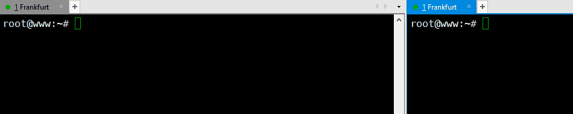

# Syn-scan

Port scanning by sending SYN package and receiving ACK package.

## Compile SynScan

    gcc SynScan.c -o SynScan

## Compile SynRecv

    make

## Insert modules into kernel

    insmod SynRecv.ko

## Remove modules from kernel

    rmmod SynRecv

